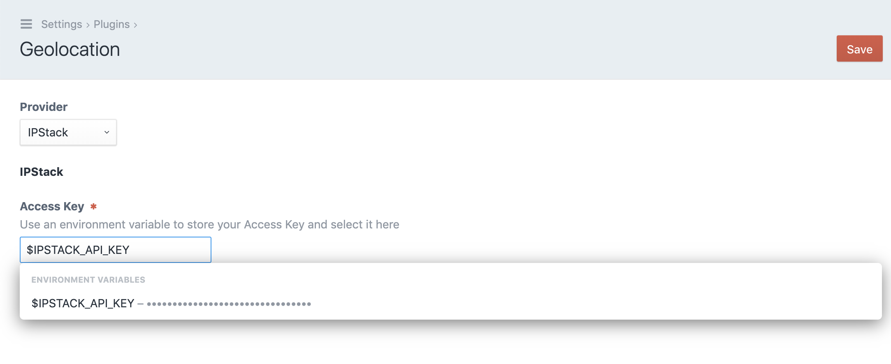
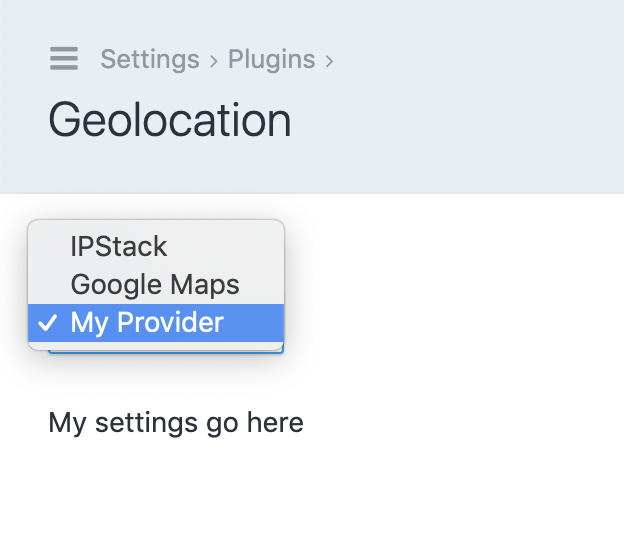

# Geolocation plugin for Craft CMS 3.x

Geolocation helper for Craft


## Requirements

This plugin requires Craft CMS 3.1.0 or later.

## Installation

To install the plugin, follow these instructions.

1. Open your terminal and go to your Craft project:

        cd /path/to/project

2. Then tell Composer to load the plugin:

        composer require unionco/geolocation

3. In the Control Panel, go to Settings → Plugins and click the “Install” button for Geolocation.

## Geolocation Overview

Geolocation comes with 2 preset geolocation backend providers - [IPStack](https://ipstack.com) and [Google Maps](https://developers.google.com/maps/documentation/geolocation/intro). Geolocation provides an interface to create your own geolocation providers. See 'Creating Your Own Provider', below.

## Configuring Geolocation

Configuration is set through the Craft CP. It is recommended to set API keys or any sensitive information as an environment variable and then use those environment variables on the Settings page.
 

## Using Geolocation

Geolocation providers return a `LatLng` object. To get the `LatLng` object from twig:
```

```
or from PHP:
```
<?php
use \unionco\geolocation\models\LatLng;
use \unionco\geolocation\GeolocationPlugin;

/** @var LatLng $location **/
$location = GeolocationPlugin::$plugin->geolocation->getCoords();
```

To calculate the distance between two `LatLng` objects, use the `Location` service:

```

```
or 
```
<?php

use unionco\geolocation\GeolocationPlugin;

// ...
$miles = GeolocationPlugin::$plugin->location->distance($latLng1, $latLng2);

```

## Creating Your Own Provider

Providers must implement the `unionco\geolocation\interfaces\GeolocationProvider` interface. An abstract base class is provided as `unionco\geolocation\providers\AbstractProvider`. See the following code for an example to get started:

```
<?php

namespace unionco\app\providers;

use unionco\geolocation\models\LatLng;
use Psr\Http\Message\ResponseInterface;
use unionco\geolocation\providers\AbstractProvider;

class MyProvider extends AbstractProvider
{
    public $baseUrl = 'https://api.myprovider.com';

    public static function handle(): string
    {
        return 'myprovider';
    }

    public static function name(): string
    {
        return 'My Provider';
    }

    public static function settingsHtml(): string
    {
        return "My settings go here";
    }

    public function getRequest($ipAddress = null): ResponseInterface
    {
        /**
         * GuzzleHttp client API request options
         * @var array $opts
         */
        $opts = [];

        return $this->client->request('GET', 'endpoint', $opts);
    }

    public function parseResponse(\stdClass $response): LatLng
    {
        // Parse the response
        return new LatLng(0, 0);
    }
}

```

See the existing providers (`IPStackProvider` and `GoogleMapsProvider`) for more details on implementation.

In your module or plugin, create an Event listener, like so:

```
<?php

// ...

use yii\base\Event;
use yii\base\Module;
use unionco\app\providers\MyProvider;
use unionco\geolocation\providers\Geolocation;
use unionco\geolocation\events\RegisterProvidersEvent;

class MyModule extends Module 
    // ...

    /**
     * @return void
     */
    public function init() {
        // ...
        
        Event::on(
            Geolocation::class,
            Geolocation::EVENT_REGISTER_PROVIDERS,
            /**
             * @return void
             */
            function (RegisterProvidersEvent $event) {
                $event->providers[] = MyProvider::class;
            }
        );
    }
```

If your provider was setup correctly, you should now see it in the Geolocation settings page; 

## Geolocation Roadmap

Some things to do, and ideas for potential features:

* Location distances in alternate units
* Geocoding interface
* Release it

Brought to you by [UNION](https://github.com/unionco)
